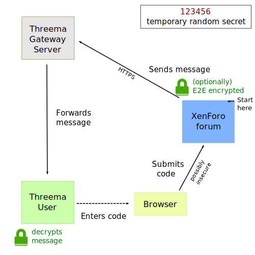

# Two factor authentication methods
## 2FA methods
Basic priority: 30 (see ThreemaGateway_Constants::TfaBasePriority)  
Range reserved: `TfaBasePriority-5` to `TfaBasePriority`

name         | server                                       | client                                     | user                                             | implemented (class)            | priority
------------ | -------------------------------------------- | ------------------------------------------ | ------------------------------------------------ | ------------------------------ | --------
Conventional | send 6 digits code                           | receive code                               | enter code into website                          | ThreemaGateway_Tfa_Conventional | 25
Reversed     | receives 6 digits code                       | sends 6 digits code                        | types code from website into phone/scans QR code | not yet                        | 27
Fast login   | sends login message, receives status updates | receives message, sends status update back | taps on accept/decline on their phone            | not yet                        | 30

### Conventional
The user gets a 6 digit code from the server delivered via Threema server and enters it into the website.  
This is like SMS verification, but it uses Threema and is therefore much more secure.

### Reversed
The user gets a 6 digit code from the server delivered directly on the login site. The users sends this code via Threema to the server (to the Gateway ID).  
This is as secure as the first methods, but it may be more confident for the user as they can use multiple methods to send the code and does not have to transcribe it manually.

### Fast login
The user gets a message showing them a user requested a login. They can now accept or decline the message. If the message is accepted the user is granted access.  
This is the most confident mode for the user, but it does not depend on a secret code anymore. Similar methods are used for Twitter and Microsoft's 2FA, but they use their own apps for this.

