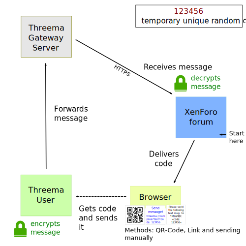
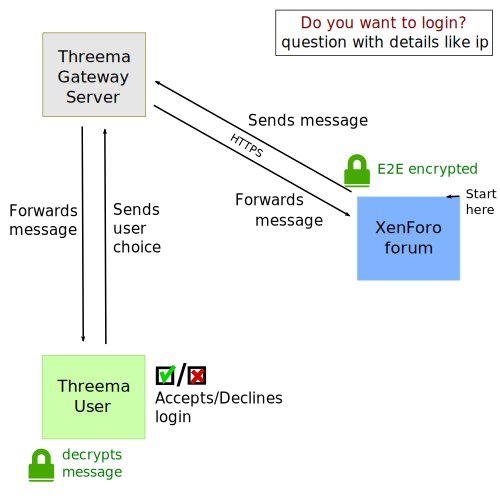

# Two factor authentication methods
## Overview
Basic priority: 30 (see ThreemaGateway_Constants::TfaBasePriority)  
Range reserved: `TfaBasePriority-5` to `TfaBasePriority`

name         | server                                       | client                                     | user                                             | implemented (class)             | priority
------------ | -------------------------------------------- | ------------------------------------------ | ------------------------------------------------ | ------------------------------- | --------
Conventional | send 6 digits code                           | receive code                               | enter code into website                          | ThreemaGateway_Tfa_Conventional | 25
Reversed     | receives 6 digits code                       | sends 6 digits code                        | types code from website into phone/scans QR code | ThreemaGateway_Tfa_Reversed     | 30
Fast login   | sends login message, receives status updates | receives message, sends status update back | taps on accept/decline on their phone            | ThreemaGateway_Tfa_Fast         | 35

## Conventional

**Pro:** Well-tested standard method  
**Contra:** Inconvenient to use

The user gets a 6 digit code from the server delivered via Threema server and enters it into the website.  
This is like SMS verification, but it uses Threema and is therefore much more secure.

This security model is well-tested and proven to work when the secret is transmitted over secure channels and only the receipient can read it. This is satisfied by the end-to-end-encryption.
Thus if no end-to-end-encryption is used the security level is weakend very much and therefore a small mesage is shown to the 2FA user when E2E encryotion is used, so one can differenciate this even as a user of the 2FA mode.

## Reversed
**Pro:** Security depends on unique secret  
**Contra:** Still quite inconvenient as one has to handle the secret

The user gets a 6 digit code from the server delivered directly on the login site. The users sends this code via Threema to the server (to the Gateway ID).  
This is as secure as the first methods, but it may be more convenient for the user as they can use multiple methods for sending the code instead of having to transcribe it manually.

The random code must not be taken as a secret here as the authentication is mostly done only by ensuring that the (previously registered) Threema ID sended a message stating to allow the login. The NaCl encryption ensures authentity of a message and the secret should just be unique to prevent potential replay attacks.

## Fast login
**Pro:** Very convenient and fast to use  
**Contra:** Security depends on user (not secret code)

The user gets a message telling them a user requested to login. They can now accept or decline the message. If the message is accepted the user is granted access.  
This is the most convenient mode for the user, but it does not depend on a secret code anymore. Similar methods are used for Twitter and Microsoft's 2FA, but they use their own apps for this.

This is secure, because here the message ID acts as a secret only known to the server and the client. This secret is never transfered outside of the Threema network. Nevertheless the security of the system does not depend on this secret.  
By acknowledging a message the client creates an authenticated and end-to-end-encrypted message stating that the previously received message ID (and therefore the message) has been acknowledged. As the message asks the question whether to allow login this is a cryptographic proof of the users decicion and can therefore be validated by the server.

The security mostly depends on how the user can estimate the vadility of the login request. An attacker could try to login at the same time and trick the user into acknowledging the wrong message.
There is also the chance that a user accidentially ackknowledges the wrong message by choosing the wrong button, which immediately and non-revocably permits the login.
